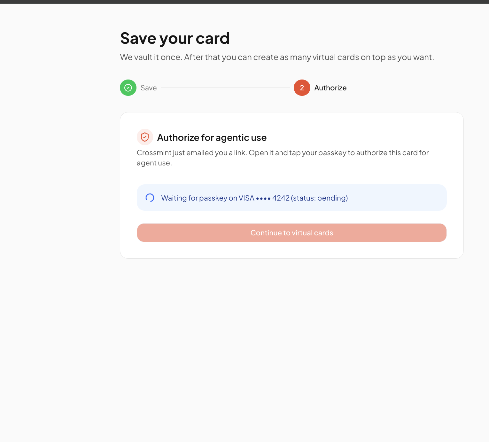
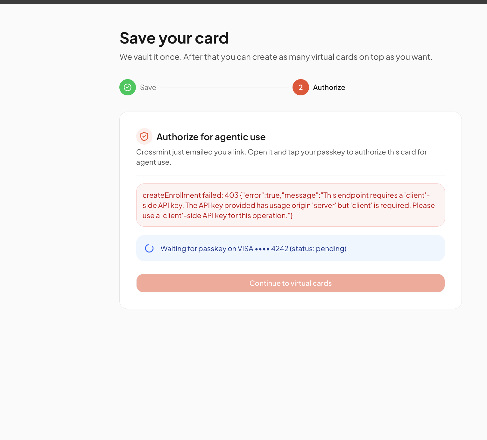
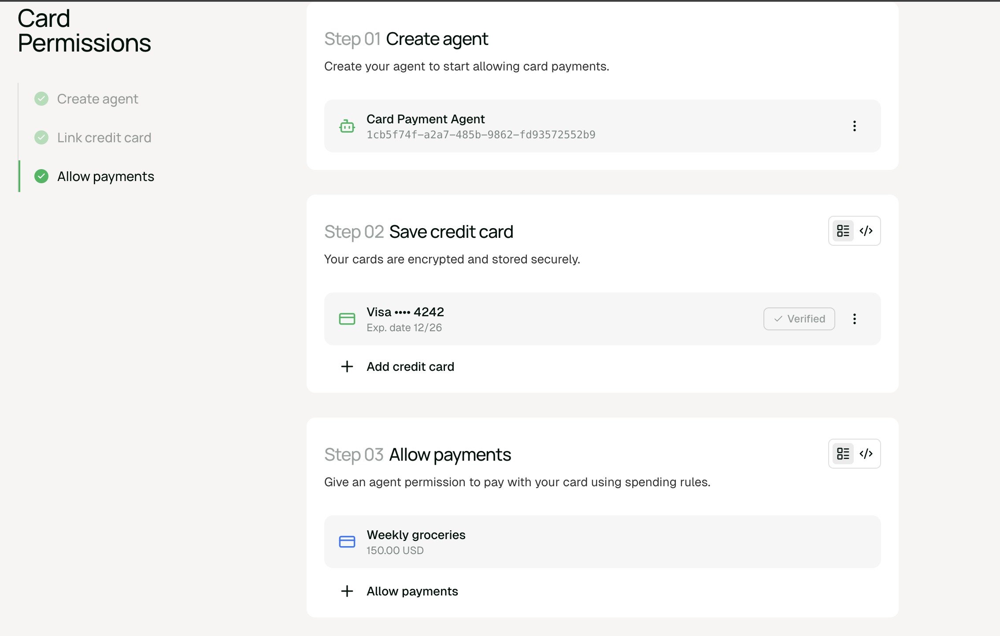
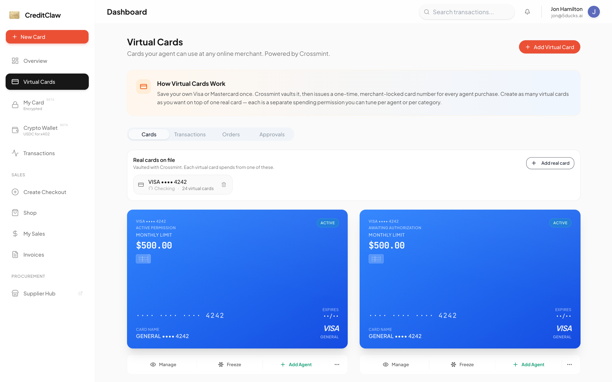

# Rail 3 — Virtual Cards

> Owner vaults their real Visa/Mastercard once in Crossmint. Each "virtual card" = one Crossmint **orderIntent** stacked on that vault with its own spending mandate. At bot checkout, Crossmint returns a **merchant-locked one-time PAN/CVC** scoped to that orderIntent. CreditClaw never stores card data.

Third outbound payment rail, alongside Rail 1 (Privy stablecoin) and Rail 5 (self-hosted encrypted real card). "Virtual Cards" tile in the owner sidebar.

---

## Vendor stack

Three stacked vendors. Knowing which one owns which surface is the single most important debugging fact.

| Layer | Vendor | Owns | Where they appear |
|---|---|---|---|
| **API + orchestration** | **Crossmint** (Card Permissions API) | Real card vaulting, agents, orderIntents, merchant-scoped credentials. PCI scope lives here. | `features/payment-rails/rail3/*` → `https://staging.crossmint.com/api/...`. SDK: `@crossmint/client-sdk-react-ui`. |
| **Ceremony UI + card issuance** | **Basis Theory** (`@basis-theory/react-agentic`) — **inferred, not documented** | Renders the Visa Agentic Commerce overlay (passkey, OTP, Click to Pay). Mock Visa SDK in test env; real Visa in prod. | Transitive dep of the Crossmint SDK. Body-portaled overlays at `z-index: 10001`. Console logs prefixed `[BtAi]`. |
| **Owner identity** | **Firebase** | Owner auth. Registered in the Crossmint Console as the 3P auth provider; Crossmint maps Firebase's `sub` claim to its `userLocator`. | `components/wallet/rail3/crossmint-provider.tsx` calls `setJwt(firebaseIdToken)`; `authFetch` sends `Authorization: Bearer <id-token>` on every BFF call. |

**Operationally:** Crossmint owns API + agent + orderIntent state. Basis Theory owns every owner-facing ceremony UI. Bugs in the overlay (z-index, pointer-events, focus, double-mount) are Basis Theory bugs, not Crossmint API bugs. Firebase produces the JWT that gates almost everything Crossmint does — see [Auth model](#auth-model).

### Basis Theory attribution — what's actually documented vs inferred

**Crossmint does not publicly name Basis Theory as the underlying provider.** Their docs, console, and SDK refer to it only as "agentic commerce" / "card permissions". The Basis Theory attribution comes from our investigation:

- The Crossmint SDK pulls in `@basis-theory/react-agentic` as a transitive dep (visible in `node_modules` and `package-lock.json`).
- The Visa Agentic Commerce overlay's iframe is hosted on a `basistheory.com` domain (visible in DevTools Network).
- Browser console logs from the overlay are prefixed `[BtAi]` (Basis Theory Agentic Initiative).

**Operational consequence:** Crossmint support won't engage on iframe / overlay / passkey UI questions framed as "Basis Theory" issues. Always frame them as "the agentic-commerce verification UI" or reference the specific symptom. Don't rely on Basis Theory's public docs — they describe a direct SDK integration we don't have. We only see the slice of Basis Theory's surface that Crossmint chose to expose through their SDK.

### SDK version policy

- **Direct dep:** `@crossmint/client-sdk-react-ui ^4.2.1` (latest npm at 2026-05-23: **4.2.2** — small drift, worth bumping).
- **No Basis Theory direct dep.** `@basis-theory/react-agentic` is transitive only. **Never install it directly.** Adding it as a top-level dep risks resolving a different version than the one Crossmint pins, breaking the overlay silently.
- **Keep Crossmint SDK current.** The agentic-commerce surface is `unstable` API-wise and the SDK absorbs that churn. Bump on every minor release, smoke-test the full ceremony in staging, then ship. Pinned-but-stale = silent breakage when Crossmint changes the overlay protocol.
- **Where to check:** `npm view @crossmint/client-sdk-react-ui versions` and the SDK's GitHub releases page (linked from the quickstart repo's README).

---

## Reference: the Crossmint quickstart

**Single most useful external reference for anyone debugging Rail 3.** When stuck, compare our shape to theirs.

- Repo: <https://github.com/Crossmint/card-permissions-quickstart>
- Live demo: <https://virtual-cards.demos-crossmint.com>
- Docs: <https://docs.crossmint.com/agents/overview>

What the quickstart does, that matters:

- **No backend.** Browser talks directly to Crossmint with Stytch JWT + client API key. No `/api`.
- **No webhooks.** Manual `fetchAllData(jwt)` re-poll after each user action.
- **No modal/dialog wrapping the SDK.** `<OrderIntentVerification>` renders inline inside a plain styled `<div>`. Internal `step` state swaps form → verification → done in place. No portal, no z-index battle.
- One agent per user. One PM per user (in the demo). N orderIntents per agent.

We diverge in two ways:

1. We mirror Crossmint state into our DB (`rail3_payment_methods`, `rail3_cards`, `rail3_agents`) so the bot side has authoritative truth without needing a live user JWT to make routing decisions.
2. We do bot-initiated checkout (the quickstart doesn't). That needs a Bearer JWT for `/order-intents/:id/credentials`, which the BFF mints headless via the Firebase refresh-token exchange (`getFreshIdToken`).

---

## The three Crossmint resources you need to understand

Before flows make sense, hold these in your head:

1. **Payment Method (PM)** — a real card vaulted in Crossmint's PCI vault. Identified by `paymentMethodId`. Created via the browser SDK. Has its own **`agentic-enrollment`** resource that must be `active` before it can back any agent purchase.
2. **Agent** — a Crossmint construct representing the entity that will spend money. Identified by `agentId`. Created with the owner's Firebase JWT. We use **one agent per owner**, lazy-created on first virtual card. (Crossmint docs: "typically one agent per user".) Agents are independent of bots — many bots can share one owner's agent.
3. **Order Intent** — one spending permission. `agent + payment-method + mandates`. Identified by `orderIntentId`. Created with the owner's JWT. Each one is what we call a "virtual card". Has a `phase`: `requires-verification` → `active` → (eventually) `expired`. Becomes `active` only after the owner completes the passkey ceremony in the browser via `<OrderIntentVerification>`.

```
Owner (Firebase user)
  └── 1 Crossmint Agent          (rail3_agents,            PK owner_uid)
  └── N Payment Methods          (rail3_payment_methods,   PK payment_method_id)
        └── must be agentic-enrolled before use
  └── N Order Intents            (rail3_cards,             PK card_id)
        agentId × paymentMethodId × mandates
        └── passkey-verified → phase=active → can issue credentials
```

The Crossmint agent is **not** stored on the PM — it's bound when the orderIntent is created. That's why deleting an agent doesn't cascade-delete PMs and vice versa.

---

## Lifecycle & expiry: three separate clocks (the #1 source of confusion)

> **NOTE (2026-06-09):** Crossmint support confirmed the flat ~7-day expiry was a **staging bug, not prod behavior**, and said they'd update their docs. We now **always send an explicit `expiresAt`** on `createOrderIntent` (owner-chosen via the "Expires" dropdown — 1y default / 1m / 1w / custom date; server defaults to +1y), persisted in the new `rail3_cards.expires_at` column. The field name `expiresAt` (camelCase) is our assumption — Basis Theory documents `expires_at` one layer down; Crossmint's order-intents endpoint is still undocumented. **TODO: revisit the expiry option once Crossmint updates their docs — check ~within a week of 2026-06-09.** If staging shows the sent value isn't honored, try `expires_at` (snake_case) before assuming the passthrough is broken. The ~7-day content below predates this fix; kept as staging-bug context.

An orderIntent's "how long / how much" behavior is governed by **three independent clocks**. Collapsing them into one is what makes expiry look broken ("I set it to monthly, why did it die in a week?"). Keep them separate:

| Clock | What it controls | Typical value | Who sets it | Where it lives |
|---|---|---|---|---|
| **Credential TTL** | The minted one-time PAN/CVC itself — single-use, short-lived. | Minutes to ~1h (Basis Theory CVC retention default 1h). | PCI / vault rules. **Not us.** | The bot-checkout response; never stored. |
| **Intent expiry** (`expires_at`) | How long the **orderIntent (= the virtual card / authorization)** stays alive and able to mint credentials *at all*. | **~7 days from creation (staging, observed).** | **Crossmint default today** — we send no value. Settable one layer down (Basis Theory Instruction `expires_at`). | The orderIntent. Surfaces only in the credentials response's `expiresAt`; **not** on `getOrderIntent`. |
| **Mandate period** | The **spend-cap refresh cadence** — when the budget resets. | `weekly` / `monthly` / `yearly`. | **Us**, via the create form → `mandates[].details.period`. | `rail3_cards.limit_period` + the Crossmint mandate. |

**The key insight:** the mandate period (e.g. `monthly`) is the *budget* clock, **not** the *lifetime* clock. The intent's ~7-day expiry fires first, so a `monthly` card never survives to its 30-day budget refresh — and a `yearly` card dies in 7 days too. Budget cadence and authorization lifetime are orthogonal.

### Where the ~7-day expiry comes from (and what we don't know)

Crossmint sits on Basis Theory's agentic stack: **Enrollment → Instruction → Credentials**. The **Instruction is our orderIntent** — it defines spending rules tied to an enrollment, carries `amount`, `description`, and a settable **`expires_at`**, and the consumer must verify it before credentials can be retrieved. So **expiry is adjustable one layer down**; the flat ~7 days is almost certainly a **Crossmint default** applied because our `createOrderIntent` body only sends `agentId / payment / mandates` and Crossmint exposes no `expires_at` passthrough to us today.

**Proven empirically (staging):**

- Two fresh intents (one `$500 monthly`, one `$100k yearly`) → credentials `expiresAt` = **creation + 7.00 days, to the second.** Period had zero effect on lifetime.
- It's anchored to **creation, not mint time**: an intent minted ~45 min after creation still expired at `creation + 7d` — so `expiresAt` is the *intent lifetime*, not a short credential TTL.
- Four older intents (ages 8–13 days, all `monthly`) → `400 "Order intent '<id>' has expired. Create a new order intent to continue."` (The wording names the *order intent* as what expired.)

**NOT settled — treat the cause as open:**

- **Possibly staging-only.** Crossmint has **not enabled production for us yet**, so 100% of these observations are Crossmint *staging*. Prod may relax the TTL or expose a passthrough. We don't know *why* the 7-day limit exists; don't assume it holds in prod.
- The exact cutoff was never bracketed (no day-6-alive vs day-8-dead test); `7.00d` is taken from Crossmint's own `expiresAt`.
- Only `monthly` intents were observed *actually* throwing "has expired"; the `yearly` card's 7-day end is its declared `expiresAt`, not a witnessed expiry (it was hours old).

### "active" ≠ spendable — the detection gap

Neither layer reliably reflects expiry:

- `rail3_cards.status` is *meant* to mirror Crossmint's `phase`, but stays `active` for expired intents — nothing flips it to `expired` (observed: all prod card rows `active` while most were actually expired).
- Crossmint's own `getOrderIntent` **also** returns `phase: "active"` for an already-expired intent.

So a card showing `active` — in our DB **or** in Crossmint's `phase` — is **not** proof it can spend. The only reliable expiry signals are: **attempt a credential mint** (it 400s with "has expired"), or **compute `created_at + 7d`**. If/when we surface expiry in the UI, **persist the real `expiresAt` from a successful credentials response** rather than hardcoding `+7d`.

---

## Verification mechanics (what the owner actually sees, and where every piece of data comes from)

There are **two distinct passkey ceremonies** in Rail 3, and they're often conflated:

| # | When | Endpoint that kicks it off | What the owner sees | What gets created |
|---|---|---|---|---|
| 1 | **PM agentic-enrollment** (Phase A4) | `POST /payment-methods/:id/agentic-enrollment` | Email OTP → "create passkey on this device" | A device-bound passkey that authorizes the **payment method** for any future agent purchase. One per `(owner, device, PM)`. |
| 2 | **OrderIntent verification** (Phase B3) | `POST /order-intents` (returns `verificationConfig` for the next step) | Single passkey tap (no OTP) | Crossmint marks the **orderIntent** as `phase: "active"`. |

The first one is the heavy ceremony (OTP + passkey enroll). The second one is the light one (just a tap of the already-enrolled passkey). Both run inside the same `<…Verification>` SDK component family.

### Verification factor: email, not phone

**The agentic-enrollment ceremony uses email OTP only.** No phone number is ever requested.

- **What we send to Crossmint:** `{email}` in the POST body of `createEnrollment`. Source: `getSessionUser(request).email` (Firebase session) in `app/api/v1/rail3/payment-methods/[paymentMethodId]/enrollment/route.ts`. Server-side. The browser never sees the email field for this purpose.
- **What we'd send for phone:** nothing. The Crossmint endpoint does not accept a `phone` field. Their docs and SDK only document email as the contact channel for the OTP. **We do not need to add a phone field to our user model for Rail 3.**
- **Where the OTP goes:** to the email we sent. Owner receives `noreply@…` from Crossmint, clicks link / enters code in the overlay, then taps passkey.

### Where the data flows in (definitive)

The overlay is body-portaled from `basistheory.com` and we have **zero control over its DOM, copy, or fields**. Every piece of data it consumes is one of:

| What the overlay shows / uses | Source | Who sets it |
|---|---|---|
| **Owner email** (for OTP delivery) | `{email}` body of `POST /agentic-enrollment` | **Us, server-side**, from Firebase session. Pre-supplied; overlay does not prompt for it. |
| **Owner identity** (whose passkey to bind) | Firebase JWT in the create-enrollment + create-order-intent calls | **Us, server-side via the browser-forwarded JWT.** |
| **Payment method** (which card the passkey authorizes) | `paymentMethodId` in the URL path | **Us, set on the wizard side after the SDK reports `onPaymentMethodSelected`.** |
| **`verificationConfig` blob** (`environment`, `publicApiKey`, plus `agentId` + `instructionId` for orderIntent ceremonies) | Response from Crossmint to our enrollment/orderIntent create call | **Crossmint.** We pass it untouched into the SDK component as a prop. |
| **Passkey UI copy, OTP form, "Cross-device passkey" warnings, "Authenticating on the other window" copy** | Basis Theory overlay code | **Vendor.** We cannot restyle, relabel, or skip steps. |
| **Visa Click to Pay confirmation** (prod only) | Visa's own UI inside the Basis Theory overlay | **Vendor (Visa).** Mock SDK in staging shows a stub instead. |

**Operational implication:** if the overlay shows the wrong email, or asks for something we didn't expect, the cause is always upstream of the overlay — usually `user.email` mismatch in our session or a stale `verificationConfig`. The overlay itself is a pure consumer of what we hand it.

### What kinds of verification are accepted

| Factor | Used? | Notes |
|---|---|---|
| Email magic-link / OTP | **Yes** (enrollment) | The only contact channel Crossmint accepts on `/agentic-enrollment`. |
| SMS / phone OTP | **No** | Not part of the agentic-enrollment surface. |
| Device passkey (WebAuthn platform authenticator) | **Yes, required** | Created during enrollment, re-tapped at every orderIntent verification. Binds to the device that did the enrollment. |
| Cross-device passkey (security key, phone-as-roaming-authenticator) | **Limited** | Basis Theory's `onNewDevice` defaults to `reenroll` — different device → owner must re-enroll the PM. Crossmint's `<CrossmintProvider>` doesn't expose this prop to us. |
| TOTP / authenticator app | **No** | Not supported. |
| Knowledge factors (password, security questions) | **No** | Not part of the agentic-commerce ceremony. |

**Net:** the only owner-supplied verification factor is **email OTP + a device passkey.** Everything else is vendor-side machinery.

---

## Data model (what we mirror locally)

| Table | What it is |
|---|---|
| `rail3_payment_methods` | One row per vaulted real card. Mirrors the Crossmint PM (last4, brand, expiry, cardholder). No FK to anything. `last_used_at` drives the "default PM" pick in `AddCardDialog`. |
| `rail3_agents` | PK `owner_uid`, columns `(owner_uid, agent_id, created_at)`. Exactly one row per owner once they've created their first virtual card. Inserted via `ON CONFLICT DO NOTHING` to survive concurrent first-card creates. |
| `rail3_cards` | One row per orderIntent. Holds our `card_id` (our nickname for it), the `order_intent_id`, the mandate array (`mandates` jsonb), `intent_mode` (`limited`/`open`), `status` (= mirror of Crossmint's `phase`: `requires-verification` / `active` / `expired` / `revoked`), `is_frozen` (owner overlay, orthogonal to lifecycle — same column shape as `rail5_cards.is_frozen`), `bot_id` (nullable), `category`, `card_name`. |
| `rail3_guardrails` | Per-card spending caps (per-tx, daily, monthly). Enforced server-side in `features/agent-interaction/approvals/rail3-fulfillment.ts` *before* credentials are fetched. |
| `rail3_transactions` | Recorded on credential issuance + settlement. |

**Credentials are never stored.** PAN/CVC/expiry live only in the bot-checkout response.

**No DB FKs** between `rail3_cards` and `rail3_payment_methods` / `bots` — integrity is application-enforced (PM-delete is blocked when cards exist).

---

## End-to-end ceremony walkthrough (canonical)

Read this top-to-bottom. Each step lists who calls what, what auth, what comes back, and what mounts in the browser.

### Phase A — Owner saves and verifies a real card (`/setup/rail3`)

**Wraps the whole page in `Rail3CrossmintProvider`** → `<CrossmintProvider>` + `FirebaseJwtBridge`. The bridge does `setJwt(await user.getIdToken())` on Firebase auth change and refreshes every 50 minutes.

**A1. Save card (browser → Crossmint, via SDK)**

```
<CrossmintPaymentMethodManagement jwt={firebaseIdToken} onPaymentMethodSelected={cb} />
```

The SDK iframe captures the card, posts directly to Crossmint, gets back a `paymentMethodId`. We never see the card details on the wire.

On success the SDK fires `onPaymentMethodSelected(pm)` where `pm = { paymentMethodId, card: { brand, last4, expiration: { month, year } } }`.

**A2. Mirror to DB (browser → our BFF)**

```
POST /api/v1/rail3/payment-methods
Authorization: Bearer <firebase-id-token>      (via authFetch)
Body: { payment_method_id, card_brand, card_last4, exp_month, exp_year }
→ 200 { payment_method_id }                    (or { already_saved: true })
```

Wizard advances to step 2.

**A3. Start agentic-enrollment (browser → our BFF → Crossmint)**

```
POST /api/v1/rail3/payment-methods/:id/enrollment
Authorization: Bearer <firebase-id-token>
→ our BFF calls Crossmint:
    POST https://staging.crossmint.com/api/unstable/payment-methods/:id/agentic-enrollment
    X-API-KEY: <CLIENT API KEY>
    Authorization: Bearer <firebase-id-token>           ← JWT-only, NOT server key
    Body: { email: <owner email> }
→ returns { enrollmentId, status: "pending", verificationConfig: { environment, publicApiKey } }
```

Browser mounts the Basis Theory enrollment overlay using that `verificationConfig`:

```
<PaymentMethodAgenticEnrollmentVerification
  paymentMethodAgenticEnrollment={pending}
  onVerificationComplete={...}
  onVerificationError={...}
/>
```

This overlay sends the owner an email OTP, then prompts them to create a passkey on the device.

**A4. Poll until active (browser → our BFF, every 3s)**

```
GET /api/v1/rail3/payment-methods/:id/enrollment
→ { enrollment: { status: "pending" | "active" | "failed", ... } }
```

`status: "active"` → wizard's "Continue to virtual cards" button enables. The Crossmint PM is now agentic-enrollment-active and can back orderIntents. **No `rail3_payment_methods` column tracks this** (we just trust Crossmint at orderIntent-create time; the PM is rejected by Crossmint if it isn't enrolled).

### Phase B — Owner creates their first virtual card (`AddCardDialog` panel)

> The component file is named `add-card-dialog.tsx` for import stability but is an **inline panel**, not a Radix `<Dialog>`. See [Gotchas](#gotchas).

**B1. Owner fills the form**

Selectables: which PM, optional bot link, mode (`limited`/`open`), if limited then max amount + period, category, nickname, optional free-text intent prompt.

**B2. Create virtual card (browser → our BFF)**

```
POST /api/v1/rail3/cards
Authorization: Bearer <firebase-id-token>      ← REQUIRED; route 401s without it
Body: {
  payment_method_id, mode, max_amount_usd?, period?,
  bot_id?, category?, card_name?, prompt?
}
```

What the route does in order:

1. **Ownership checks.** PM exists and `pm.owner_uid === user.uid`. If `bot_id` supplied, same check.
2. **`getOrProvisionAgent(user.uid, user.email, jwt)`** — DB read; if no `rail3_agents` row for this owner, calls `provisionAgentForOwner({ jwt, ownerEmail })` which POSTs:
   ```
   POST https://staging.crossmint.com/api/2025-06-09/agents
   X-API-KEY: <CLIENT API KEY>
   Authorization: Bearer <firebase-id-token>   ← JWT-only, server key gets 403
   Body: { metadata: { name: "CreditClaw Agent — <email>" } }
   → { agentId, metadata }
   ```
   Then `INSERT ... ON CONFLICT DO NOTHING`. On race (two parallel first-card creates), the loser's Crossmint agent is orphaned — warn-logged, accepted cost. This is the only place an agent is ever created.
3. **`buildMandates(input)`** — owner-input → Crossmint mandate array. Crossmint requires ≥1 mandate.
   - `limited`: `[{type:"maxAmount", value, details:{currency:"usd", period}}, {type:"description", value}]` plus optional `{type:"prompt", value}`.
   - `open`: `[{type:"maxAmount", value:"100000.00", details:{currency:"usd", period:"yearly"}}, {type:"description", value:"General-purpose card permission — no merchant restriction"}]`.
4. **`createOrderIntent({jwt, agentId, paymentMethodId, mandates})`** — POSTs:
   ```
   POST https://staging.crossmint.com/api/unstable/order-intents
   X-API-KEY: <CLIENT API KEY>
   Authorization: Bearer <firebase-id-token>   ← JWT-only, server key gets 403
   Body: { agentId, payment: { paymentMethodId }, mandates }
   → {
       orderIntentId,
       phase: "requires-verification",
       agentId,
       payment: { paymentMethodId },
       mandates,
       verificationConfig: { environment, publicApiKey, agentId, instructionId }
     }
   ```
   `verificationConfig.instructionId` is the **single-use** id the SDK will redeem in the browser. It cannot be re-used (relevant to StrictMode gotcha below).
5. **Write the row.** `rail3_cards` insert with `status = intent.phase` (`"requires-verification"`) and `is_frozen = false`. Bump `rail3_payment_methods.last_used_at`.
6. **Respond with the full intent** so the browser can mount the ceremony without a follow-up GET:
   ```
   200 {
     card_id, order_intent_id, status, is_frozen,
     intent_mode, limit_amount_cents, limit_period,
     verification_config       ← the SDK consumes this directly
   }
   ```

**B3. Owner does the passkey ceremony (browser, Basis Theory overlay)**

Panel swaps to the "Authorize this card" step. We render:

```jsx
<OrderIntentVerification
  orderIntent={{                                    // useMemo'd
    orderIntentId,
    phase: "requires-verification",
    payment: { paymentMethodId },
    mandates: [],
    verificationConfig,                             // from the create response
  }}
  onVerificationComplete={handleVerificationComplete}   // useCallback'd
  onVerificationError={handleVerificationError}         // useCallback'd
/>
```

The SDK internally calls `verifyInstruction(agentId, instructionId)` against Crossmint to confirm the instruction is live, then drives the Basis Theory overlay (Visa Click to Pay in prod, mock in test). Owner taps passkey. Overlay closes. `onVerificationComplete` fires.

**B4. Reconcile with Crossmint truth (browser → our BFF)**

```
POST /api/v1/rail3/cards/:cardId/refresh-phase
Authorization: Bearer <firebase-id-token>      ← REQUIRED; route 401s without it

→ server calls Crossmint:
    GET https://staging.crossmint.com/api/unstable/order-intents/:orderIntentId
    X-API-KEY: <CLIENT API KEY>
    Authorization: Bearer <firebase-id-token>   ← JWT-only, server key gets 403

→ updates rail3_cards.status if it changed
→ returns { card_id, order_intent_id, status }
```

**Why a separate reconcile step.** The SDK's `onVerificationComplete` only means "the ceremony's UI finished". Crossmint's backend is authoritative on the actual `phase`. Trusting the SDK alone caused the writeback gap (DB stuck on `requires-verification` forever) that the pre-2026-05-23 code had — see `_completed/rail3-verification-writeback-plan.md`.

**B5. UI shows "Authorized"** when `phase === "active"`. Owner closes the panel.

### Phase C — Bot checkout (headless, no live user)

```
POST /api/v1/bot/rail3/checkout    (called by the bot at purchase time)
Body: { card_id, merchant: { name, url, countryCode } }
```

1. Load card + PM. Assert `pm.verification_status === "active"` (locally tracked), `card.status === "active"`, and `!card.isFrozen`. Frozen returns `403 card_frozen`; non-active lifecycle returns `403 card_not_active`.
2. Run guardrails (`rail3-fulfillment.ts`) against the requested amount.
3. Fetch one-time credentials:
   ```
   POST https://staging.crossmint.com/api/unstable/order-intents/:orderIntentId/credentials
   Body: { merchant: { name, url, countryCode } }
   → { card: { number, expirationMonth, expirationYear, cvc }, expiresAt }
   ```
   **Auth (shipped).** Crossmint requires a Bearer JWT on this endpoint too. `credentials.ts` takes a `jwt`, and the bot route mints a fresh Firebase ID token server-side via `getFreshIdToken(card.ownerUid)` (exchanges the owner's stored refresh token with Google). The failure mode is no longer 403 — it's `ReauthRequiredError` (no/stale refresh token on file), surfaced as `412 reauth_required`, meaning the owner must sign in again to repopulate the token. Verified: Crossmint accepts a refresh-token-minted Bearer and returns credentials.
4. Reshape the response into the Rail-5 fill-card format so OpenClaw fills the checkout form unchanged.
5. Bot calls `POST /api/v1/bot/rail3/confirm` after the charge clears → recorded in central orders with `rail: "rail3"`.

### Phase D — Delete

- **Delete virtual card** → `DELETE /api/v1/rail3/cards/:cardId` → server calls `revokeOrderIntent({jwt, orderIntentId})` (JWT-only) → DB row deleted. PM untouched.
- **Delete PM** → `409 has_virtual_cards` if any `rail3_cards` row references it. Owner must delete cards first. Then `deletePaymentMethod({jwt, paymentMethodId})` (JWT-only) → DB row deleted.

---

## Auth model (definitive)

Three auth modes against Crossmint. **Picking the wrong one is the most common Rail 3 mistake.** The code comments in `features/payment-rails/rail3/*.ts` are authoritative if this table ever drifts.

| Mode | Headers + query | When used |
|---|---|---|
| **JWT (owner-present)** | `X-API-KEY: <CLIENT API KEY>` + `Authorization: Bearer <firebase-id-token>` | All write endpoints (`/agents`, `/order-intents`, `/payment-methods/:id/agentic-enrollment`, deletes). All Crossmint SDK iframes/components. |
| **Server key + userLocator** | `X-API-KEY: <SERVER API KEY>` + `?userLocator=userId:<uid>` | Owner-scoped reads from the BFF where we have no JWT. Currently only `listPaymentMethods`. |
| **Server key (no userLocator)** | `X-API-KEY: <SERVER API KEY>` | Global / non-owner-scoped server calls. Not used today. |

**Why JWT for everything important.** Crossmint's agentic-commerce surface explicitly rejects server-key + userLocator on the write endpoints — the docs say "requires a 'client'-side API key" and "requires a JWT from an external auth provider … Crossmint Auth is not supported". Tested and reproduced in staging.

**Browser SDK side.** `Rail3CrossmintProvider`'s `FirebaseJwtBridge` calls `setJwt(idToken)` on auth change and refreshes every 50 min. Any Crossmint SDK component (`CrossmintProvider`-wrapped) reads from there. If the bridge isn't mounted, the iframe loads but never authorizes — silently.

**Server side.** `authFetch` on the browser always sends `Authorization: Bearer <id-token>`; routes use `extractBearerJwt(request)` to forward it to Crossmint. Routes that need it (`/cards` POST, `/refresh-phase` POST, `/payment-methods/:id/enrollment`, deletes) 401 with `bearer_required` when it's missing.

**`crossmint-env.ts` is the single source of truth** for Crossmint host/keys. It is split on purpose: Rail 2 + Worldstore stay on **staging** (`CROSSMINT_HOST` / `CROSSMINT_SERVER_API_KEY` / `CROSSMINT_CLIENT_API_KEY`), while Rail 3 runs on **production** via the `RAIL3_*` exports (`RAIL3_CROSSMINT_HOST` / `RAIL3_CROSSMINT_SERVER_API_KEY` / `RAIL3_CROSSMINT_CLIENT_API_KEY` / `RAIL3_CROSSMINT_CLIENT_ORIGIN`). The split exists because there is a single `CROSSMINT_WEBHOOK_SECRET` used by the Worldstore card-wallet webhook, and Rail 3 has no webhook dependency — so Rail 3 moving to prod must not drag Worldstore/Rail 2 along. Rail 3 files import the `RAIL3_*` names (aliased locally to the old identifiers); don't read `process.env` Crossmint vars directly anywhere else.

---

## Staging vs production

### Where we are today

**Rail 3 runs on production; Rail 2 + Worldstore stay on staging.** `features/payment-rails/crossmint-env.ts`:

```ts
// Rail 2 + Worldstore (staging)
export const CROSSMINT_HOST = "https://staging.crossmint.com";
export const CROSSMINT_SERVER_API_KEY = process.env.CROSSMINT_SERVER_API_KEY_STAGING;
export const CROSSMINT_CLIENT_API_KEY = process.env.NEXT_PUBLIC_CROSSMINT_CLIENT_API_KEY_STAGING;

// Rail 3 virtual cards (production) — client key is origin-locked to creditclaw.com
export const RAIL3_CROSSMINT_HOST = "https://www.crossmint.com";
export const RAIL3_CROSSMINT_SERVER_API_KEY = process.env.CROSSMINT_SERVER_API_KEY;
export const RAIL3_CROSSMINT_CLIENT_API_KEY = process.env.NEXT_PUBLIC_CROSSMINT_CLIENT_API_KEY;
export const RAIL3_CROSSMINT_CLIENT_ORIGIN = "https://creditclaw.com";
```

Available env secrets: `CROSSMINT_SERVER_API_KEY` (prod) + `CROSSMINT_SERVER_API_KEY_STAGING`, `NEXT_PUBLIC_CROSSMINT_CLIENT_API_KEY` (prod) + `NEXT_PUBLIC_CROSSMINT_CLIENT_API_KEY_STAGING`. The prod **client** key is origin-locked, so every Rail 3 client-key call (server helper + browser SDK) must present `Origin: https://creditclaw.com`; the server-side helpers set it explicitly, and the browser passkey ceremony only works when served from the deployed `creditclaw.com` domain (not the workspace preview). A redeploy is required for the prod client key to be baked into the client bundle.

### What's different in production

| Surface | Staging | Production |
|---|---|---|
| API host | `staging.crossmint.com` | `www.crossmint.com` |
| Test cards | `4242 4242 4242 4242` etc — Crossmint test PMs accepted | Only real US-issued Visa/Mastercard credit/debit |
| Visa overlay | **Mock Visa SDK** — no real Click to Pay confirmation, passkey simulated | **Real Visa Click to Pay** — actual confirmation, real device passkey, real cross-device-passkey rejection |
| OTP delivery | Real emails (Crossmint sends them) | Same — real emails |
| Money | Test money — no real charges, but Crossmint will still issue PANs | Real money — real charges hit the vaulted card |
| Webhooks | n/a (we don't use webhooks) | n/a |
| Console | <https://staging.crossmint.com/console> | <https://www.crossmint.com/console> — separate project, separate 3P auth config |

**Implication:** the staging Visa mock hides every real-world failure mode (popup blocker, cross-device passkey mismatch, Visa Click to Pay UX glitches, slow Visa response). Anything that "works in staging" is necessary but not sufficient.

### How to flip to production

1. **Configure the prod Crossmint project (console):** register Firebase as the 3P auth provider (paste Firebase project ID + JWKS URL), copy the prod client + server API keys, allowlist the prod app's domain.
2. **Set env vars in the prod environment:** ensure `CROSSMINT_SERVER_API_KEY` and `NEXT_PUBLIC_CROSSMINT_CLIENT_API_KEY` are present (they are). Set `CROSSMINT_ENV=production` and `NEXT_PUBLIC_CROSSMINT_ENV=production` only if we want a runtime switch later — today they're unused.
3. **Edit `crossmint-env.ts` (three lines):**
   ```ts
   export const CROSSMINT_HOST = "https://www.crossmint.com";
   export const CROSSMINT_SERVER_API_KEY = process.env.CROSSMINT_SERVER_API_KEY;
   export const CROSSMINT_CLIENT_API_KEY = process.env.NEXT_PUBLIC_CROSSMINT_CLIENT_API_KEY;
   ```
4. **Bump `@crossmint/client-sdk-react-ui`** to the latest minor (currently 4.2.2) before testing prod — Crossmint absorbs the prod-vs-staging overlay differences inside the SDK; running the latest minimizes drift from their reference quickstart.
5. **Confirm owners' refresh tokens are being captured in prod.** The refresh-token exchange that powers headless bot checkout is already shipped (`getFreshIdToken`); each owner's token is captured at sign-in. Verify a prod owner has a populated `owners.firebase_refresh_token` before relying on bot checkout — a missing token surfaces as `412 reauth_required`, not a silent failure.
6. **Smoke test the full ceremony in prod (real card, real money in trivial amount):**
   - PM save → agentic-enrollment → email OTP → real passkey on the test device → status `active`.
   - Create one virtual card → `<OrderIntentVerification>` → real passkey tap → `phase: active`.
   - Manual bot checkout (`POST /api/v1/bot/rail3/checkout`) at a low-risk merchant → real PAN issued → real charge → settlement → `confirm` records the order.
   - Repeat each ceremony from a **second device** to surface the cross-device-passkey path that staging hides.
7. **Watch the first 10 prod owners closely** — popup blocker, mobile Safari WebAuthn quirks, slow Visa overlay responses are the failure modes that don't appear in staging.

### What we can't test until prod

- Real Visa Click to Pay UX (timing, copy, third-party-cookie reqs).
- Real cross-device passkey rejection (Visa's `onNewDevice=reenroll` path).
- Real declines from the vaulted card issuer (insufficient funds, fraud holds).
- Production webhook URLs (n/a today — we don't use them).

---

## Crossmint API surface (what we call, mapped to wrappers)

All paths under `https://staging.crossmint.com/api/` (staging) or `https://www.crossmint.com/api/` (prod).

| Endpoint | Method | Auth | Wrapper | Notes |
|---|---|---|---|---|
| `/2025-06-09/agents` | POST | **JWT** | `agents.createAgent` | Body: `{ metadata: { name, description? } }`. Returns `{ agentId, metadata }`. |
| `/unstable/payment-methods` | GET | server key + userLocator | `paymentMethods.listPaymentMethods` | Returns `{ data: CrossmintPaymentMethod[], nextCursor, previousCursor }`. |
| `/unstable/payment-methods` | POST | (browser SDK) | n/a — `<CrossmintPaymentMethodManagement>` posts directly | Fires `onPaymentMethodSelected(pm)` to the wizard. |
| `/unstable/payment-methods/:id` | DELETE | **JWT** | `paymentMethods.deletePaymentMethod` | 404 treated as success (idempotent). |
| `/unstable/payment-methods/:id/agentic-enrollment` | GET | **JWT** | `agenticEnrollment.getEnrollment` | 404 normalized to `{ status: "not_started" }`. |
| `/unstable/payment-methods/:id/agentic-enrollment` | POST | **JWT** | `agenticEnrollment.createEnrollment` | Body: `{ email }`. Returns `{ enrollmentId, status: "pending", verificationConfig }`. |
| `/unstable/order-intents` | POST | **JWT** | `permissions.createOrderIntent` | Body: `{ agentId, payment: { paymentMethodId }, mandates }`. Returns `{ orderIntentId, phase, verificationConfig, … }`. |
| `/unstable/order-intents/:id` | GET | **JWT** | `permissions.getOrderIntent` | Phase enum: `requires-verification` \| `active` \| `expired`. |
| `/unstable/order-intents/:id` | DELETE | **JWT** | `permissions.revokeOrderIntent` | 404 treated as success. |
| `/unstable/order-intents/:id/credentials` | POST | **JWT** (headless: minted via `getFreshIdToken` refresh-token exchange) | `credentials.fetchOneTimeCredentials` | Body: `{ merchant: { name, url, countryCode } }`. Returns `{ card: { number, expirationMonth, expirationYear, cvc }, expiresAt }`. `expiration*` are STRINGS. `expiresAt` = intent expiry (~7d), not a credential TTL — see the Lifecycle & expiry section. |

**No webhooks.** Crossmint supports webhooks but we don't use any — same as the quickstart. State sync is pull-based: `/refresh-phase` after the orderIntent ceremony, polling during PM enrollment. If reaching for a webhook, first check whether a pull at the same point would work.

---

## Conventions — do / don't

### Do

- **Wrap every Rail-3 surface in `Rail3CrossmintProvider`.** The JWT bridge is what makes the SDK iframes authorize.
- **Render `<OrderIntentVerification>` and `<PaymentMethodAgenticEnrollmentVerification>` inline.** Plain `<div>` parent. `useMemo` the input object and `useCallback` the handlers so the SDK gets stable refs.
- **After every ceremony, reconcile with Crossmint.** Cards: `POST /api/v1/rail3/cards/:cardId/refresh-phase`. PMs: poll `GET /api/v1/rail3/payment-methods/:id/enrollment`. The SDK callback only says "UI ended".
- **Use `authFetch` from the browser to anything in `/api/v1/rail3/*`** so the Bearer JWT lands server-side for forwarding to Crossmint.
- **Use the matching Crossmint auth mode per endpoint** (table above). When in doubt, JWT.
- **Import Crossmint env from `features/payment-rails/crossmint-env.ts`.** Single source of truth.

### Don't

- **Don't wrap any Crossmint SDK component inside a Radix `<Dialog>`** (or any modal/portal that sets `pointer-events: none` on `<body>`). Basis Theory portals its overlay to `<body>` at z-index 10001 and inherits the `none`, making the overlay un-clickable. Fix is to render inline, not to work around the inheritance — we tried the MutationObserver workaround and it was unreliable. The component is named `add-card-dialog.tsx` for import stability only; it's a panel.
- **Don't memoize the SDK with `React.memo`.** Once `useMemo`/`useCallback` keep the props stable, the SDK is already stable. The previous `OrderIntentVerificationStable = memo(...)` layer was over-engineering and is gone (2026-05-23).
- **Don't add a webhook listener "for safety".** Pull-after-ceremony covers what we need.
- **Don't try to call `/agents`, `/order-intents`, or `/agentic-enrollment` write endpoints with the server key.** Crossmint will 403. Use JWT.
- **Don't add a DB FK** between `rail3_cards` and `rail3_payment_methods` / `bots`. Integrity is application-enforced.
- **Don't read `card.cardholderName`.** It doesn't exist — cardholder name lives on the PM (`pm.cardholderName`).
- **Don't forget `"rail3"` in the `recordOrder` rail union.** Silently typechecks against `OrderInput.rail` but fails at the writer.
- **Don't create agents anywhere except `getOrProvisionAgent` in `app/api/v1/rail3/cards/route.ts`.** One owner = one agent, lazy-created on first card. Adding a second creation site will leak orphan agents.

---

## Gotchas

- **Dialog → panel refactor (2026-05-23).** Through 2026-05-22 `AddCardDialog` was a Radix `<Dialog>` wrapping `<OrderIntentVerification>`. Dialog set `pointer-events: none` on `<body>`; Basis Theory's body-portaled overlay inherited it; clicks were swallowed; the ceremony hung on "Authenticating on the other window". The MutationObserver workaround that forced `pointer-events: auto` was unreliable; removing the Dialog wrapper eliminated the root cause.
- **React StrictMode double-mount kills the ceremony in dev.** Crossmint's `verifyInstruction(agentId, instructionId)` runs in an effect with deps `[ready, agentId, instructionId]`. StrictMode double-mounts the component; the second mount calls `verifyInstruction` with the same single-use `instructionId`; Crossmint resolves instantly → `onVerificationComplete` fires → parent unmounts the SDK. **Symptom:** `[BtAi] Visa SDK loaded successfully` appears **twice** in console; overlay flashes ~1s and disappears. Workaround: test in prod, disable StrictMode locally, or gate `onVerificationComplete` behind a ≥500ms timer.
- **Agent creation requires a live JWT.** There's no path to create a Crossmint agent server-side without the owner being online. If `POST /api/v1/rail3/cards` is ever called without a Bearer (e.g. a future cron), agent provisioning will 401 before any work happens. Same for bot checkout's credentials call (open).
- **Cross-device passkey mismatch (prod).** Visa binds the passkey to the device that did the original PM enrollment. A different device → SDK logs `[BtAi] Cross-device passkey mismatch detected ... onNewDevice=reenroll`. Crossmint's `<CrossmintProvider>` doesn't expose the `onNewDevice` prop, so we can't tune it. Workaround: complete the orderIntent ceremony on the same device that enrolled the PM, or re-vault the PM.
- **Popup blocker swallows WebAuthn (prod desktop).** No console error, just a spinner forever. Check the popup-blocked icon in the URL bar.
- **`instructionId` is single-use.** Crossmint mints a fresh one per orderIntent create. If you re-mount the verification component with the same `instructionId`, Crossmint resolves it immediately as completed. This is what makes StrictMode break the dev ceremony.
- **PM `status` is dead weight.** We hard-delete PMs, so it's effectively always `"active"`. Kept for parity.
- **Open mode is still merchant-scoped at credential time.** "No limit" = no permission-level cap, not a reusable PAN. Every credential issuance is still merchant-locked by Crossmint.
- **Stale comment in `app/setup/rail3/page.tsx`.** Says "Crossmint agents are created lazily per-bot" — that was the old model. Per-owner now. Cosmetic.

---

## Debugging recipe: "the card is stuck at requires-verification"

**Step 1.** Get DB state:

```sql
SELECT card_id, order_intent_id, status, is_frozen, last_used_at, created_at
FROM rail3_cards
WHERE owner_uid = '<uid>'
ORDER BY created_at DESC LIMIT 5;
```

**Step 2.** Get Crossmint's truth. JWT required — server key returns 403.

```
GET https://staging.crossmint.com/api/unstable/order-intents/<orderIntentId>
Headers:
  X-API-KEY: $NEXT_PUBLIC_CROSSMINT_CLIENT_API_KEY_STAGING
  Authorization: Bearer <firebase-id-token-for-owner>
```

For local diagnostics, mint a Firebase ID token via firebase-admin → identitytoolkit `signInWithCustomToken`. Reference script lives in chat (search "check-crossmint.mjs").

**Step 3.** Interpret:

| Crossmint `phase` | DB `status` | Diagnosis | Fix |
|---|---|---|---|
| `requires-verification` | `requires-verification` | Ceremony never finished on Crossmint's side. SDK didn't complete. | Look at the SDK-mount path. Common: popup blocked, StrictMode dev double-mount, dialog wrapping the SDK, cross-device passkey mismatch. |
| `active` | `requires-verification` | Ceremony succeeded on Crossmint; our writeback didn't run. | Call `POST /api/v1/rail3/cards/:cardId/refresh-phase` manually. If that works, investigate why the SDK's `onVerificationComplete` never fired (or wasn't wired to the refresh call). |
| `expired` | anything | Rarely seen — Crossmint usually keeps `phase: active` even after the intent's ~7-day expiry (see Lifecycle & expiry). If you do see `expired`, the intent is dead. | User must re-create the card. Note: an intent can be expired-but-look-active (`phase: active` past `created_at + 7d`) — confirm by attempting a credential mint. |

Same shape for PM enrollment via `GET /api/unstable/payment-methods/:id/agentic-enrollment`.

---

## Status

### Implemented ✅

- Three-table data model (`rail3_payment_methods` + `rail3_cards` + `rail3_agents`).
- Backend wrappers (`features/payment-rails/rail3/*`) with correct auth mode per endpoint.
- Owner API routes (`app/api/v1/rail3/*`) including `/refresh-phase` writeback.
- Bot API routes (`app/api/v1/bot/rail3/*`).
- UI: setup wizard (`/setup/rail3`), virtual-cards page, PaymentMethodsStrip, AddCardDialog inline panel.
- Firebase ↔ Crossmint JWT bridge with 50-min auto-refresh (`Rail3CrossmintProvider`).
- Lazy per-owner agent provisioning on first card create, race-safe via `ON CONFLICT DO NOTHING`.
- Per-card guardrails (`rail3_guardrails`) enforced in `rail3-fulfillment.ts`.
- Verified end-to-end on Crossmint staging (2026-05-23): create card → passkey ceremony → `status='active'` written back to DB.
- **Owner-triggered sync from Crossmint** (`POST /api/v1/rail3/sync` + `Rail3SyncButton` compact icon next to the `/virtual-cards` page title). Single-pass converging diff against Crossmint's truth: cards-removed before PMs-removed (tracked via `deletedCardIds: Set`), update path recomputes `intentMode` / `limitAmountCents` / `limitPeriod` from the latest mandates, recursive canonical-JSON compare on mandates (Crossmint reorders `details` keys e.g. `{period,currency}` ↔ `{currency,period}`). Helper: `listOrderIntents` in `features/payment-rails/rail3/permissions.ts` — JWT-only, client-key + Bearer. Storage: `getAllRail3CardsByOwnerUid`. Live test (2026-05-27) confirmed convergence in one pass and surfaced a Crossmint orphan-intent (PM deleted but orderIntent still exists) which the sync correctly skips + reports in `errors[]`. **Owner-facing branding:** the button label, hover label, and modal copy say "**Refresh from Visa**" / "in sync with **Visa**" — Crossmint is hidden behind Visa in this surface only (backend/code/internal docs still say Crossmint).
- **Headless bot-checkout auth via Firebase refresh-token exchange.** `credentials.ts` sends a Bearer JWT minted server-side by `getFreshIdToken(ownerUid)` (exchanges the owner's stored refresh token with Google); the token is captured at every sign-in. Refresh token stored **plaintext by decision** — app-layer encryption intentionally declined (no `OWNER_REFRESH_TOKEN_ENCRYPTION_KEY`). Crossmint accepts the minted Bearer and returns credentials (proven via prod=staging probes). Absent/stale token → `412 reauth_required`. Remaining: live in-app prod E2E.

### Outstanding ❌

| # | Item | Blocking? | Notes |
|---|---|---|---|
| 1 | **`/api/v1/rail3/transactions/` route audit** | Unknown | Route exists, never validated against current schema. |
| 2 | **Mobile prod verification ceremony unmounting mid-flow** | Unverified post-refactor | Was observed pre-dialog-removal. May or may not still reproduce — needs re-test. |
| 3 | **Stale comment in `app/setup/rail3/page.tsx`** | Cosmetic | "Crossmint agents are created lazily per-bot" — should say per-owner. |

---

## Screenshots

Captured UI for the ceremonies and surfaces that aren't in the code. Drop new screenshots into `_images/rail3/` next to this doc and reference them here.

### Our wizard — `/setup/rail3`, step 2 (Authorize for agentic use)

The happy-path pending state after `POST /payment-methods/:id/enrollment` succeeds. The blue strip is our own UI; the email + passkey UI that appears next is Basis Theory's overlay portaled to `<body>` (not captured here because the overlay closes on success).



### Our wizard — same step, surfacing the historic `client-side API key` 403

This is what `createEnrollment` returned through 2026-05-22 when our wrapper sent the server-key + userLocator combo to the JWT-only `/agentic-enrollment` endpoint. If this string ever shows up again, the wrapper is sending the wrong auth — check `agenticEnrollment.ts` is using `enrollmentHeaders(jwt)` (client key + Bearer), not the shared `crossmintCardsFetch` helper.



### Crossmint's own Card Permissions quickstart UI (reference only)

The quickstart's reference shape: three numbered sections (Create agent / Save credit card / Allow payments). Our wizard collapses 1+2 (lazy agent on first card, save card in step 1) and treats 3 as the separate `/virtual-cards` page. Useful when comparing what they show vs what we show.



### Our `/virtual-cards` page (current as of 2026-05-23)

Owner dashboard after the wizard: vaulted real card at the top, virtual cards (= orderIntents) below. The right-hand card showing `AWAITING AUTHORIZATION` is the visible state for `status: "requires-verification"` — owner needs to open it and complete the passkey ceremony.



### Adding more

- File location: `project_knowledge/internal_docs/04-payment-tools/rail3/_images/rail3/`
- Naming: `kebab-case-descriptive.png`. Prefer "what + state" (`wizard-step2-authorize-pending.png`) over filenames/dates.
- Worth capturing next: the Basis Theory email-OTP overlay, the passkey-create overlay, the cross-device-passkey rejection screen (will only appear in prod), the AddCardDialog inline panel in its three states (form / authorize / done).

---

## References

### Internal

- **Open-points tracker (start here):** `project_knowledge/internal_docs/04-payment-tools/rail3/_open-points.md` — flat checklist of everything outstanding on Rail 3.
- **Open plans (deep dives):**
  - `project_knowledge/internal_docs/04-payment-tools/_payment_build_ideas/260528_rail3-master-agent-plan.md` — holding doc for the in-house Master Agent capability. Coupled to Rail 3 via the auth-model question (one shared `agentId` vs JWT-bound). A Path-A outcome would let the Master Agent spend with the org server key, reducing reliance on the per-owner refresh-token exchange for that flow.
- Archived plans + superseded docs: `project_knowledge/internal_docs/04-payment-tools/rail3/_completed/` — per-user agent rework, env single-source, verification writeback, staging migration, frontend rewire, add-card preview, prior open-points tracker, prior operational docs.

### External

- **Crossmint quickstart repo (canonical reference):** <https://github.com/Crossmint/card-permissions-quickstart>
- **Quickstart live demo:** <https://virtual-cards.demos-crossmint.com>
- **Crossmint Card Permissions docs:** <https://docs.crossmint.com/agents/overview>
- **Crossmint API reference:** <https://docs.crossmint.com/api-reference>
- **Crossmint Console** (3P auth provider config, server/client keys): <https://staging.crossmint.com/console>
- **Basis Theory React Agentic SDK:** <https://www.npmjs.com/package/@basis-theory/react-agentic>
- **Crossmint staging vs production:** <https://docs.crossmint.com/introduction/platform/staging-vs-production>
